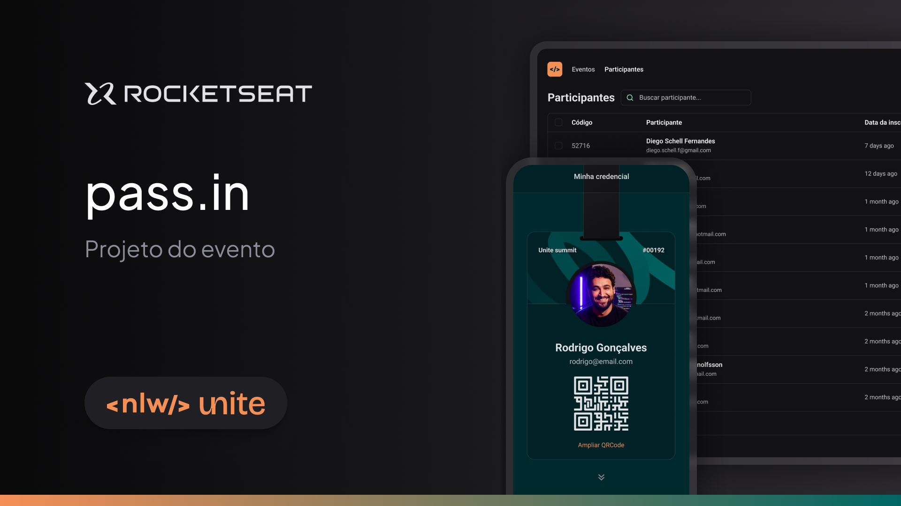

<p align="center">
<a href="https://github.com/laysaalves/rocketseat-nlw/blob/main/README-PTBR.md">Não fala inglês? Clique aqui para ler em português!</a>
</p>

<p align="center">
  <a href="#introduction">Introduction</a>&nbsp;&nbsp;&nbsp;|&nbsp;&nbsp;&nbsp;
  <a href="#technologies">Technologies</a>&nbsp;&nbsp;&nbsp;|&nbsp;&nbsp;&nbsp;
  <a href="#getting-started">Run the app</a>&nbsp;&nbsp;&nbsp;|&nbsp;&nbsp;&nbsp;
  <a href="#layout">Layout in Figma</a>&nbsp;&nbsp;&nbsp;|&nbsp;&nbsp;&nbsp;
  <a href="#license">License</a>&nbsp;&nbsp;&nbsp;
</p>

<p align="center">
  
<p>

---
## Introduction

Application developed during Rocketseat's NLW, with the aim of making the organization of participants in a fictitious event practical (it can be adapted to a real one), where the user can request their credential, obtain it on the screen of the mobile device and present it on the day of the event to release their entry with the unique QR Code generated for each participant.

---
## Technologies

-  [Node.js](https://nodejs.org/en/docs/) for API consumption;
-  [SQLite](https://www.sqlite.org/docs.html/) as the database;
-  [React Native](http://facebook.github.io/react-native/) with the [Expo](https://expo.io/);
-  [Axios](https://github.com/axios/axios) for communication with the API;
-  [NativeWind](https://www.nativewind.dev/) to style the components;
-  [Prisma](https://www.prisma.io/) as the ORM for the database;
-  [TypeScript](https://www.typescriptlang.org/) for data typing;
-  [Zod](https://zod.dev/) to validate the data;
-  [Zustand](https://zustand-demo.pmnd.rs/) for global state management.

---
## Getting Started

### Requisites

  - You must have **[Node.js](https://nodejs.org/en/)** installed on your computer;
  - You must have **[Git](https://git-scm.com/)** installed and configured on your computer;
  - Also, you **need** a package manager, the one I used was **[NPM](https://www.npmjs.com/)**;
  - Finally, you must have **[Expo Go](https://expo.dev/go)** installed on your device if you want to view the application directly from it.

### Installation

1. Make a clone of the repository:

```bash
  $ git clone (https://github.com/laysaalves/rocketseat-nlw.git)
```

2. Run the app:

```bash
  # Mobile app
  $ cd mobile
  # Installing the project dependencies
  $ npm install
  # Start the mobile app
  $ npx expo start
  # Select where you want to view the app (iOS or Android) or if it's on your own device, scan the QRCode
```

---
## Layout

Click here to open the project layout on [Figma](https://www.figma.com/community/file/1356738933008624188/unite-summit) made by [Rocketseat](https://github.com/rocketseat-education).

---
## License

This project is under the MIT license. See the [LICENSE](LICENSE.md) file for more details.

---
[Back to top](#introduction)<br>

---
<sup><br/>Project developed with the tutorship of [Rodrigo Gonçalves](https://github.com/orodrigogo), during the [**Next Level Week**](https://rocketseat.com.br/) of [**Rocketseat**](https://www.linkedin.com/school/rocketseat/about/)**💜.</sup>
